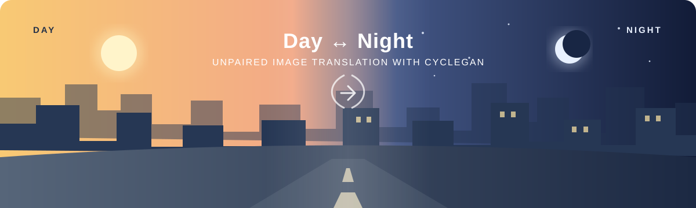
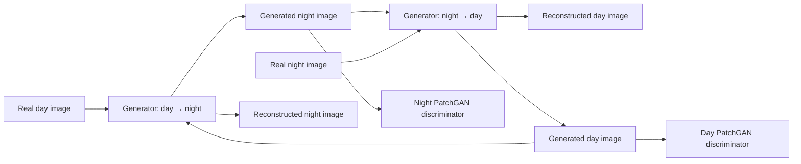
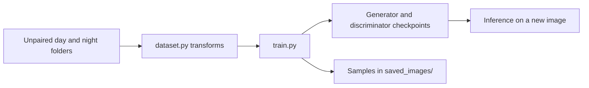

<p align="center">
  
</p>

<h1 align="center">Day–Night Image Translation with CycleGAN</h1>

<p align="center">
  Unpaired image-to-image translation for changing the appearance of a scene
  while keeping its underlying layout recognizable.
</p>

<p align="center">
  <a href="#overview">Overview</a> ·
  <a href="#how-it-works">How it works</a> ·
  <a href="#getting-started">Getting started</a> ·
  <a href="#results">Results</a> ·
  <a href="#references">References</a>
</p>

---

## Overview

Day and night images rarely come in perfectly aligned pairs. CycleGAN learns
translations between the two domains from **unpaired collections**: one set of
daytime scenes and one set of nighttime scenes. This project uses that approach
to create low-visibility scenes from daylight images and to explore the reverse
translation.

| Input domain | Learned translation | Output domain |
| :--- | :---: | ---: |
| Daytime scenes | `G_day→night` | Nighttime appearance |
| Nighttime scenes | `G_night→day` | Daytime appearance |

The project discusses the [BDD100K](https://bdd-data.berkeley.edu/) driving
dataset and the LARD runway dataset as application contexts. The result shown
below comes from the stated BDD training run; it does not establish performance
on LARD or on a downstream perception task.

### Why unpaired translation?

- **Paired data is scarce.** Capturing the same scene, camera position, and
  objects under both lighting conditions is difficult.
- **Scene content matters.** A useful translation should change appearance
  without moving roads, vehicles, or other important structures.
- **Synthetic conditions can broaden evaluation.** Generated scenes may help
  stress-test vision systems, but their value must be measured on the target
  task before they are used for training or safety claims.

## How it works

CycleGAN trains two generators and two discriminators. Each generator proposes
an image in the opposite domain; its discriminator judges whether the result
looks like a real image from that domain. A cycle-consistency loss asks the
round trip to recover the starting image.



| Component | Role in this implementation |
| --- | --- |
| Two ResNet generators | Translate day ↔ night; each uses nine residual blocks, downsampling, upsampling, and a final `tanh` |
| Two PatchGAN discriminators | Judge local image patches rather than a single whole-image score |
| Adversarial loss | Encourages outputs to resemble the target domain |
| Cycle-consistency loss | Encourages a round trip to preserve scene content |
| Identity loss | Helps avoid unnecessary changes to images already in the target domain |

The training code also includes gradient accumulation, mixed precision with
CUDA AMP, and periodic checkpoint saving to help manage GPU memory.

## Project layout

```text
.
├── config.py                 Training settings and paths
├── dataset.py                Day/night image loading and transforms
├── generator_model.py        ResNet generator
├── discriminator_model.py    PatchGAN discriminator
├── train.py                  Training loop
└── utils.py                  Checkpoints, sample saving, and seeding
```

## Getting started

### 1. Install the dependencies

Use a Python and PyTorch combination compatible with your machine. The project
also uses Albumentations, NumPy, tqdm, and Pillow. Install the versions required
by your environment before training.

### 2. Arrange the images

The two training domains are separate folders; image pairs are **not** needed.

```text
data/
├── train/
│   ├── days/
│   │   ├── day_img_1.jpg
│   │   └── ...
│   └── nights/
│       ├── night_img_1.jpg
│       └── ...
└── val/
    ├── days/
    │   └── day_val_1.jpg
    └── nights/
        └── night_val_1.jpg
```

Create `saved_images/` for sample outputs. Check the paths and image size in
`config.py` before starting a run.

### 3. Train

```bash
python train.py
```



Adjust the learning rate, batch size, epoch count, and identity/cycle loss
weights in `config.py`. The practical batch size depends on image resolution
and available GPU memory.

## Inference

The original project loads saved generator checkpoints and applies the same
resize and normalization used during training. The example below follows its
documented `gen_Z` day-to-night direction; confirm the direction and checkpoint
names in your own training run.

```python
import torch
import torchvision.transforms as transforms
from PIL import Image

import config
from generator_model import Generator

device = config.DEVICE
generator = Generator(img_channels=3, num_residuals=9).to(device)
checkpoint = torch.load("genz.pth.tar", map_location=device)
generator.load_state_dict(checkpoint["state_dict"])
generator.eval()

transform = transforms.Compose([
    transforms.Resize((256, 256)),
    transforms.ToTensor(),
    transforms.Normalize([0.5] * 3, [0.5] * 3),
])

image = Image.open("path/to/day/image.jpg").convert("RGB")
tensor = transform(image).unsqueeze(0).to(device)

with torch.no_grad():
    generated = generator(tensor)

pixels = (generated.squeeze(0) * 0.5 + 0.5).clamp(0, 1)
pixels = (pixels.cpu().permute(1, 2, 0).numpy() * 255).astype("uint8")
Image.fromarray(pixels).save("night_output.jpg")
```

## Results


The reported BDD run used **506 images over 35 epochs**. The example is a
qualitative illustration of day-to-night and clear-to-adverse translation.
Appearance was sensitive to hyperparameters. No quantitative fidelity,
semantic-preservation, or downstream task metric was supplied with this README,
so the image should not be read as a benchmark result.

## Limitations and next steps

- Evaluate content preservation, artifacts, and diversity with held-out images
  and appropriate metrics.
- Test whether generated data improves a specific perception model on real
  adverse-condition test data.
- Compare against paired, multi-domain, and content/style-disentanglement
  methods when suitable datasets are available.
- Extend experiments to fog, rain, and aviation imagery only after defining
  domain-specific evaluation criteria.

## References

- Zhu, Park, Isola, and Efros, [*Unpaired Image-to-Image Translation using
  Cycle-Consistent Adversarial Networks*](https://arxiv.org/abs/1703.10593).
- [Original CycleGAN implementation](https://github.com/junyanz/CycleGAN).
- Related directions mentioned in the project: UNIT, MUNIT, DRIT, StarGAN,
  EnlightenGAN, ToDayGAN, and spatial-attention GANs.

---

This README describes a research implementation. Generated images are useful
for experimentation; any claim about safer autonomous driving or aviation
requires separate validation on the intended task and deployment setting.
